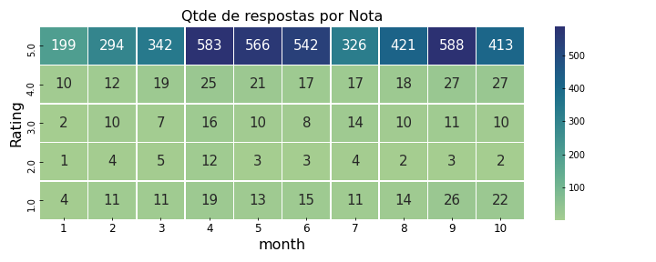
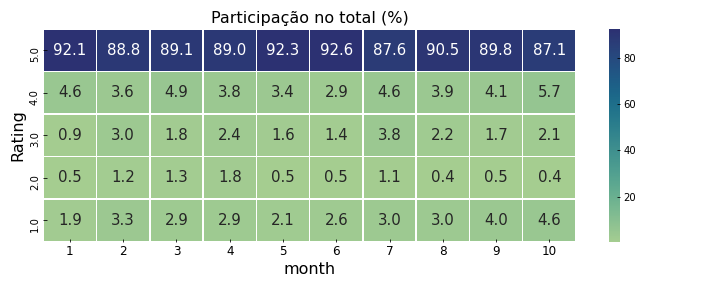
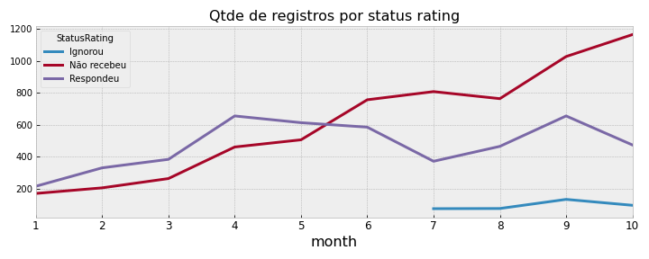
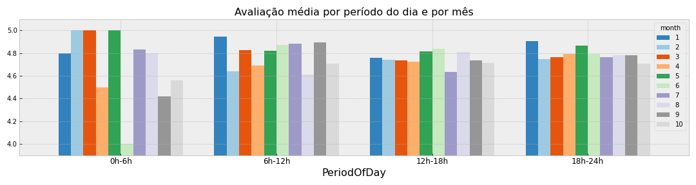

## Sumário 

[Introdução](#Introdução)

[1. Qual a causa raiz da queda na avaliação média dos pedidos?](#1.-Qual-a-causa-raiz-da-queda-na-avaliação-média-dos-pedidos?)

[1.1.1 Realmente existe uma queda?](#1.1.1-Realmente-existe-uma-queda?)

[1.1.2 Considerações](#1.1.2-Considerações)   

[1.2 Qual a causa raiz desta queda?](#1.2-Qual-a-causa-raiz-desta-queda?)

[1.2.1 A queda ocorreu por conta da redução nas respostas?](#1.2.1-A-queda-ocorreu-por-conta-da-redução-nas-respostas?)

[1.2.2 O período do dia influencia a quantidade de respostas](#1.2.2-O-período-do-dia-influencia-a-quantidade-de-respostas)

[1.2.3 Considerações](#1.2.3-Considerações) 

[2. Interromper os investimentos ou seguir um plano B para continuar aumentando pedidos?](#2.-Interromper-os-investimentos-ou-seguir-um-plano-B-para-continuar-aumentando-pedidos?)

[2.1.1 O aumento de pedidos reduziu a avaliação média?](#2.1.1-O-aumento-de-pedidos-reduziu-a-avaliação-média?)

[2.1.2 Qual foi o impacto do aumento do investimento em marketing?](#2.1.2-Qual-foi-o-impacto-do-aumento-do-investimento-em-marketing?)

[2.1.3 Conclusão (recomendação de ação)](#2.1.3-Conclusão-(recomendação-de-ação))

[Considerações finais e próximos passos](#Considerações-finais-e-próximos-passos)
 
 

## Introdução
Esta análise tem por objetivo responder ou oferecer alguma luz na questão proposta no case: identifique qual é a **causa raiz** do problema apresentado e informe à equipe se eles devem **interromper todos os investimentos** ou se **existe um plano B** que eles possam seguir para **continuar aumentando os pedidos**. 

A partir da questão acima, definimos 2 objetivos principais: 
 
1. Identificar a causa raiz da queda na avaliação média dos pedidos.
2. Propor a interrupção dos investimentos ou um plano B.
 
 
   
    
## Desenvolvimento
    
###  1. Qual a causa raiz da queda na avaliação média dos pedidos?

#### 1.1.1 Realmente existe uma queda?

> O Rating médio varia bastante ao longo dos meses de 2017, mas é possível perceber uma certa alteração um pouco mais agressiva na segunda quinzena de julho.
 
 
 
 
 

>Também é possível observar essa queda quando analisado o mês fechado.
>Outros meses do ano também chegaram próximo do patarmar de julho. 

 
 
 
 

>Quando olhamos a quantidade de respostas recebidas, ou seja, quantos clientes nos avaliaram ao longo dos dias, vemos novamente um forte movimento de queda no início de julho.

 
 
 
 
 
>Olhando o mês fechado, novamente vemos uma queda em julho em relação a junho (de cerca de 40%).

 
 
 
 
 

>Quando observamos a quantidade de respostas por nota, vemos que a nota 5 foi a que apresentou maior queda (95% de toda a queda está na nota 5).
 
  
  
   
 

>A participação dela sobre o total caiu quase 5 p.p. 

  
 
 
 
 
       
#### 1.1.2 Considerações
Temos elementos para acreditar que realmente existiu uma queda no mês de julho. Contudo, os gráficos parecem sugerir que não houve queda nas avaliações, houve queda nas avaliações **de nota 5**. A princípio, isso não indica necessariamente um aumento na insatisfação dos usuários/consumidores, já que não vem acompanhado de aumento nas respostas 1, 2, 3 e 4 (em julho).

 
 

#### 1.2 Qual a causa raiz desta queda? 

##### 1.2.1 A queda ocorreu por conta da redução nas respostas?
 
> Por conta da maneira como esta queda nas respostas acontece (maior nas respostas 5 estrelas), ela pode sim impactar na avaliação média.
No gráfico abaixo, observamos duas coisas:
> - Um aumento no número de casos em que o usuário não recebeu o e-mail solicitando a avaliação. Mas este aumento já vem acontecendo desde o início do ano, então, aparentemente, isso não justifica a queda na avaliação média.
> - Uma queda nas respostas desde abril, com o pior mês sendo justamente o mês de julho. Isso pode sinalizar que uma queda na quantidade de respostas pode impactar na avaliação média, principalmente porque a queda nas respostas em geral acontece mais na nota 5.  

 
 
 
 

##### 1.2.2 O período do dia influencia a quantidade de respostas

> Interessante notar que a avaliação média se apresentou diferente, dependendo do período do dia (inclusive no mês de julho): 

 

Enquanto que no período das 18h às 24h a avaliação média se mantém estávavel entre os meses junho a setembro, o período 12h às 18h se destaca pela queda que apresenta na avaliação média em julho. O periodo 6h às 12h também apresenta queda, mas em agosto.
 
 
 
 

> A queda na quantidade de avaliações 5 estrelas (que já vimos anteriormente que é onde mais caiu no período analisado), é bem maior no período 18h-24h. **Esta queda de cerca de 170 avaliações (280-110) representa quase 80% da queda total de avaliações 5 estrelas.** 

 
 
 
 

> Uma redução de pedidos e clientes acontece nos meses julho e agosto no período diurno (6h às 18h )- apesar da receita ter crescido. Essa queda de pedidos e clientes não foi muito sentida como um todo porque o período das 18h às 24h apresentou crescimento neste mesmo período (jul/ago). 

 

> No período das 6h às 12hs, a redução de pedidos e clientes é ainda mais agressiva que no período 12h-18h.

A queda de pedidos em ambos os períodos pode ser a causa da queda nas respostas (principalmente 5 estrelas), e consequentemente, a queda na avaliação média.  
 
 

##### 1.2.3 Considerações

- De maneira geral, uma queda no número de avaliações influencia muito na avaliação média, porque essa queda de respostas geralmente é maior nas avaliações 5 estrelas.
- Cerca de 80% da queda nas avaliações 5 estrelas ocorreu em pedidos realizados no período das 12h às 18h.
- Nesse mesmo período (12h-18h) houve uma queda de pedidos e de clientes, que pode ter sido a causa da queda nas avaliações (menos pedidos, menos avaliaçoes).
- A ausência do e-mail solicitando a avaliação por parte do cliente também pode ter ocasionado queda nas respostas, já que, sem o e-mail, o cliente pode não avaliar proativamente.

Se removermos as avaliações dos pedidos que foram feitos das 6h às 18hs, este seria o cenário: 

 
 

#### 2. Interromper os investimentos ou seguir um plano B para continuar aumentando pedidos?

##### 2.1.1 O aumento de pedidos reduziu a avaliação média?

> Podemos descartar a hipótese de que o aumento de pedidos nos meses julho e agosto pode estar ocasionando queda na avaliação média, visto que em julho e agosto **não houve aumento de pedidos de uma maneira geral**. 

 
 
 
 
 

>Esse aumento de pedidos ocorre em setembro apenas, quando também voltar a crescer o número de respostas (+40%) e a avalição média assim como a quantidade de respostas nota 5 volta a crescer. 

 
 
 
 

##### 2.1.2 Qual foi o impacto do aumento do investimento em marketing?

> Esse aumento no investimento ocorrido a partir de agosto aparentemente* trouxe mais pedidos e users, já que em setembro e outubro observamos este aumento (como visto anteriormente).
 
###### *Não fizemos uma análise de causa e efeito. 
 
  
 
 

> Interessante notar que a receita total e a receita por cliente (abaixo) já vinham aumentando desde julho (talvez, como reflexo da mudança da plataforma).

 
 
 
 
 
 

> Esse aumento de pedidos é mais expessivo no período 12h às 18h e principalmente no período da noite (18h às 24h), onde a avaliação média foi maior. 

##### 2.1.3 Conclusão (recomendação de ação)

Manter o investimento em marketing pelas seguintes razões:

- O aumento do investimento em Marketing pode ser a causa do aumento de pedidos a partir de setembro.
- Do ponto de vista da avaliação do serviço, 

### Considerações finais e próximos passos