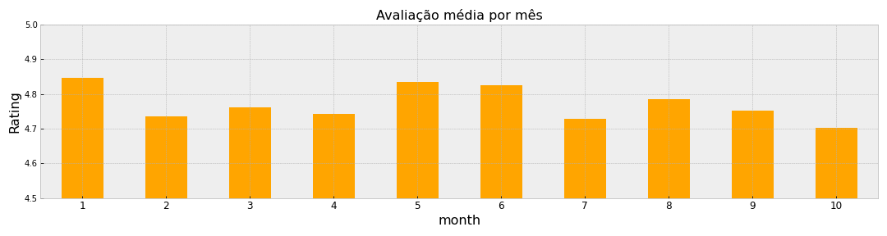

### Missão

Identifique qual é a **causa raiz** do problema apresentado e informe à equipe se eles devem **interromper todos os investimentos** ou se **existe um plano B** que eles possam seguir para **continuar aumentando os pedidos**.

Vamos delimitar o escopo da análise em 2 objetivos principais, com base nas informações obtidas no case:

i) Identificar a causa raiz da queda na avaliação média dos pedidos 

  
    
ii) Propor a interrupção dos investimentos ou um plano B
    
    
#### Conclusão

 
 
 
 

####  1. Qual a causa raiz da queda na avaliação média dos pedidos?

##### 1.1 Primeiro, vamos confirmar que realmente existe uma queda:

> O Rating médio varia bastante ao longo dos meses de 2017, mas é possível perceber uma certa alteração um pouco mais agressiva na segunda quinzena de julho.
 
 
 
 
 

>Também é possível observar essa queda quando analisado o mês.

>Outros meses do ano também chegaram próximo do patarmar de julho, porém, a média se apresentava melhor nos dois meses anteriores. 

 
 
 
 

>Quando olhamos a quantidade de respostas recebidas, ou seja, quantos clientes nos avaliaram ao longo dos dias, vemos novamente um forte movimento de queda no início de julho.

 
 
 
 

>Olhando o mês fechado, novamente vemos uma queda em julho em relação a junho (de cerca de 40%).

 
 
 
 
 

>Quando observamos a quantidade de respostas por nota, vemos que a nota 5 foi a que apresentou maior queda (95% de toda a queda esta na nota 5)
 
 
 
 
 

>A participação dela sobre o total caiu quase 5 p.p.
    
 
 
 
 
       
##### 1.2 Conclusão:
Temos elementos para acreditar que realmente existiu uma queda no mês de julho. Contudo, os gráficos parecem sugerir que não houve queda nas avaliações, houve queda nas avaliações **de nota 5**. Isso não necessariamente indica um aumento na insatisfação dos usuários/consumidores, já que não houve aumento no número das respostas 1, 2, 3 e 4.

 
 

##### 2. Qual a causa raiz desta queda?