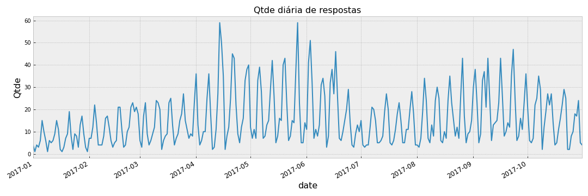
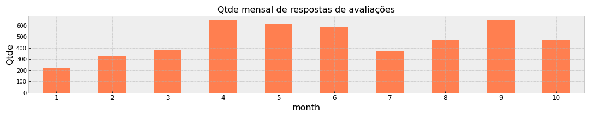

### Missão

Identifique qual é a **causa raiz** do problema apresentado e informe à equipe se eles devem **interromper todos os investimentos** ou se **existe um plano B** que eles possam seguir para **continuar aumentando os pedidos**.

Vamos delimitar o escopo da análise em 2 objetivos principais, com base nas informações obtidas no case: 
 
1. Identificar a causa raiz da queda na avaliação média dos pedidos 

  
    
2. Propor a interrupção dos investimentos ou um plano B
    
    
#### Conclusão

 
 
 
 

####  1. Qual a causa raiz da queda na avaliação média dos pedidos?

##### 1.1.1 Realmente existe uma queda?

> O Rating médio varia bastante ao longo dos meses de 2017, mas é possível perceber uma certa alteração um pouco mais agressiva na segunda quinzena de julho.
 
 
 
 
 

>Também é possível observar essa queda quando analisado o mês.
>Outros meses do ano também chegaram próximo do patarmar de julho, porém, a média se apresentava melhor nos dois meses anteriores. 

 
 
 
 

>Quando olhamos a quantidade de respostas recebidas, ou seja, quantos clientes nos avaliaram ao longo dos dias, vemos novamente um forte movimento de queda no início de julho.

 
 
 
 
 
>Olhando o mês fechado, novamente vemos uma queda em julho em relação a junho (de cerca de 40%).

 
 
 
 
 

>Quando observamos a quantidade de respostas por nota, vemos que a nota 5 foi a que apresentou maior queda (95% de toda a queda esta na nota 5)
 
  
  
   
 

>A participação dela sobre o total caiu quase 5 p.p. 

  
 
 
 
 
       
##### 1.1.2 Conclusão:
Temos elementos para acreditar que realmente existiu uma queda no mês de julho. Contudo, os gráficos parecem sugerir que não houve queda nas avaliações, houve queda nas avaliações **de nota 5**. A princípio, isso indica não necessariamente  um aumento na insatisfação dos usuários/consumidores, já que não acompanhado de aumento nas respostas 1, 2, 3 e 4.

 
 

##### 1.2 Qual a causa raiz desta queda? 

Quando olhamos a quantidade de registros aberto por "Respondeu", "Ignorou" e "Não recebeu", vemos um aumento no número de casos em que o usuário não recebeu o e-mail solicitando a avaliação. 

    
 
 
 

#### 2. Interromper os investimentos ou seguir um plano B para continuar aumentando pedidos?

##### 2.1.1 O aumento de pedidos reduziu a avaliação média?

> Podemos descartar a hipótese de que o aumento de pedidos nos meses julho e agosto pode estar ocasionando queda na avaliação média, visto que em julho e agosto **não houve aumento de pedidos**. 

>Esse aumento de pedidos ocorre em setembro apenas, quando também voltar a crescer o número de respostas (+40%) e a avalição média e a quantidade de respostas nota 5 volta ao patamar de Abril. 

 
 
 
 

##### 2.1.2 Qual foi o impacto do aumento do investimento em marketing?

> Esse aumento no investimento ocorrido a partir de agosto aparentemente* trouxe mais pedidos e users, já que em setembro e outubro observamos este aumento (como visto anteriormente).

 
 
 
 

> Esse aumento de pedidos é mais expessivo no período 12h às 18h e principalmente no período da noite (18h às 24h), onde a avaliação média costuma ser maior. 

