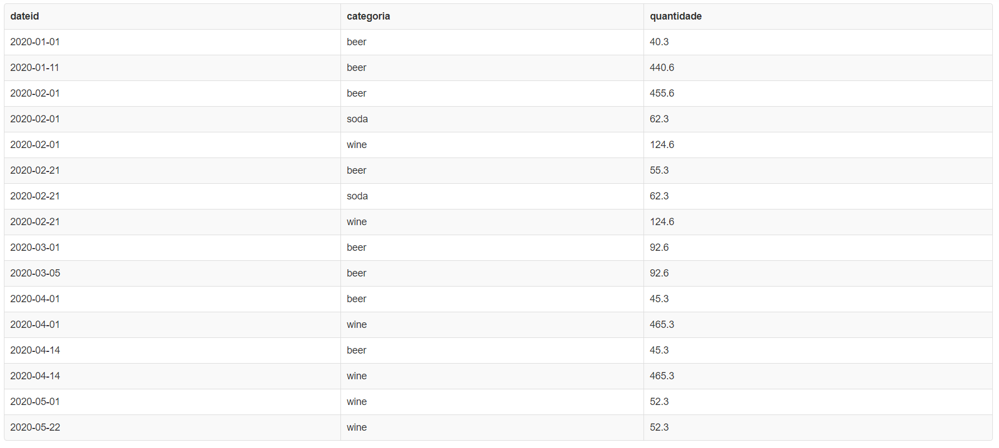

### Respostas do Desafio II

### Exercício 1:

Dados os gráficos abaixo, construa um modelo dimensional para representar as informações.

Resposta: Os dados são apresentados sob três prismas (dimensões): Data, Produto e Cliente. Portanto, o seguinte modelo dimensional poderia ser utilizado:

[Aqui](exercicio1/images/data_model.sql), você encontra o script para a criação do modelo.

### Exercício 2:

Dado o modelo dimensional apresentado, crie as seguintes consultas em SQL:

i) Retornar a evolução da quantidade em estoque por categoria de produto por data;
ii) Retornar a posição de estoque mais recente da quantidade de produtos por categoria;
iii) Retornar a quantidade de produtos distintos que já foram armazenados em cada estado.

Respostas:
Criei um script para a inserção de dados em um DB PostgreSQL (dados fake). Você pode simular esta inserção [aqui](http://sqlfiddle.com/) (escolha a opção PostgreSQL 9.3). Em seguida, para cada pergunta, execute uma query usando os scripts que criei.

i) Este é o retorno dos dados para esta consulta [(Script1)](exercicio2/first.sql)

ii) Este é o retorno dos dados para esta consulta [(Script2)](exercicio2/second.sql)

iii) Este é o retorno dos dados para esta consulta [(Script3)](exercicio2/third.sql))

