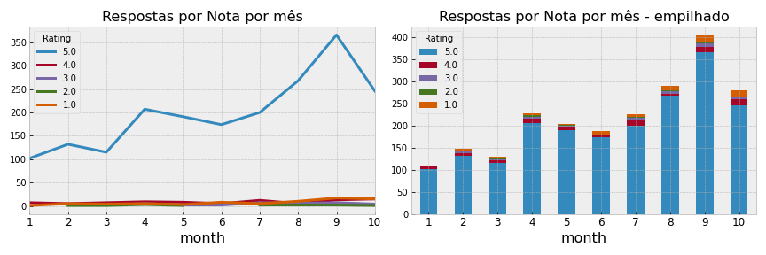

## Sumário 

[Introdução](#introdução)

##### [1. Qual a causa raiz da queda na avaliação média dos pedidos?](#1-qual-a-causa-raiz-da-queda-na-avaliação-média-dos-pedidos-1)

[1.1.1 Realmente existe uma queda?](#111-realmente-existe-uma-queda)

[1.1.2 Considerações](#112-considerações)   
 
[1.2 Qual a causa raiz desta queda?](#12-qual-a-causa-raiz-desta-queda)

[1.2.1 A queda ocorreu por conta da redução nas respostas?](#121-a-queda-ocorreu-por-conta-da-redução-nas-respostas)

[1.2.2 O período do dia influencia a quantidade de respostas](#122-o-período-do-dia-influencia-a-quantidade-de-respostas)

[1.2.3 Considerações](#123-considerações) 

##### [2. Interromper os investimentos ou seguir um plano B para continuar aumentando pedidos?](#2-interromper-os-investimentos-ou-seguir-um-plano-b-para-continuar-aumentando-pedidos-1)

[2.1.1 O aumento de pedidos reduziu a avaliação média?](#211-o-aumento-de-pedidos-reduziu-a-avaliação-média)

[2.1.2 Qual foi o impacto do aumento do investimento em marketing?](#212-qual-foi-o-impacto-do-aumento-do-investimento-em-marketing)

[2.1.3 Conclusão (recomendação de ação)](#213-conclusão-(recomendação-de-ação))

[Considerações finais e próximos passos](#considerações-finais-e-próximos-passos)
 
 

## Introdução
Esta análise tem por objetivo responder ou oferecer alguma luz na questão proposta no case: identifique qual é a **causa raiz** do problema apresentado e informe à equipe se eles devem **interromper todos os investimentos** ou se **existe um plano B** que eles possam seguir para **continuar aumentando os pedidos**. 

A partir da questão acima, definimos 2 objetivos principais: 
 
1. Identificar a causa raiz da queda na avaliação média dos pedidos.
2. Propor a interrupção dos investimentos ou um plano B.
 
 
   
    
## Desenvolvimento
    
###  1. Qual a causa raiz da queda na avaliação média dos pedidos?

#### 1.1.1 Realmente existe uma queda?

> O Rating médio varia bastante ao longo dos meses de 2017, mas é possível perceber uma certa alteração um pouco mais agressiva na segunda quinzena de julho.
 
 
 
 
 
 

>Também é possível observar essa queda quando analisado o mês fechado.
>Outros meses do ano também chegaram próximo do patarmar de julho. 

 
 
 
 
 

>Quando olhamos a quantidade de respostas recebidas, ou seja, quantos clientes nos avaliaram ao longo dos dias, vemos novamente um forte movimento de queda no início de julho.

 
 
 
 
 
 
>Olhando o mês fechado, novamente vemos uma queda em julho em relação a junho (de cerca de 40%).

 
 
 
 
 
 

>Quando observamos a quantidade de respostas por nota, vemos que a nota 5 foi a que apresentou maior queda (95% de toda a queda está na nota 5).
 
  
  
   
 
 

>A participação dela sobre o total caiu quase 5 p.p (5 estrelas jul x jun). 

  
 
 
 
 
 
       
#### 1.1.2 Considerações
Temos elementos para acreditar que realmente existiu uma queda no mês de julho. Contudo, os gráficos parecem sugerir que não houve queda nas avaliações, houve queda nas avaliações **de nota 5**. A princípio, isso não indica necessariamente um aumento na insatisfação dos usuários/consumidores, já que não vem acompanhado de aumento nas respostas 1, 2, 3 e 4 (em julho).
 
 
 
 
 

#### 1.2 Qual a causa raiz desta queda? 

##### 1.2.1 A queda ocorreu por conta da redução nas respostas?
 
> Por conta da maneira como esta queda nas respostas acontece (maior nas respostas 5 estrelas), ela pode sim impactar na avaliação média.
No gráfico abaixo, observamos duas coisas:
> - Um aumento no número de casos em que o usuário não recebeu o e-mail solicitando a avaliação. Mas este aumento já vem acontecendo desde o início do ano, então, aparentemente, isso não justifica a queda na avaliação média.
> - Uma queda nas respostas desde abril, com o pior mês sendo justamente o mês de julho. Isso pode sinalizar que uma queda na quantidade de respostas pode impactar na avaliação média, principalmente porque a queda nas respostas em geral acontece mais na nota 5.  

 
 
 
 
 

##### 1.2.2 O período do dia influencia a quantidade de respostas

> Interessante notar que a avaliação média se apresentou diferente, dependendo do período do dia (inclusive no mês de julho): 

 

Enquanto que no período das 18h às 24h a avaliação média se mantém estávavel entre os meses junho a setembro, o período 12h às 18h se destaca pela queda que apresenta na avaliação média em julho. O periodo 6h às 12h também apresenta queda, mas em agosto. 

##### Os clientes diurnos são os mesmos clientes noturnos? Será que o nível de servido muda, porque são clientes com perfis diferentes?
 
 
 
 
 

> A queda na quantidade de avaliações 5 estrelas (que já vimos anteriormente que é onde mais caiu no período analisado), é bem maior no período 12h-18h. **Esta queda de cerca de 170 avaliações (280-110) representa quase 80% da queda total de avaliações 5 estrelas.** 

 
 
 
 
 

> Uma redução de pedidos e clientes acontece nos meses julho e agosto no período diurno (6h às 18h ) - apesar da receita ter crescido. Essa queda de pedidos e clientes não foi muito sentida como um todo porque o período das 18h às 24h apresentou crescimento neste mesmo período (jul/ago). 

 

> No período das 6h às 12hs, a redução de pedidos e clientes é ainda mais agressiva que no período 12h-18h.
 

A queda de pedidos em ambos os períodos (e não apenas o não envio do e-mail) também pode ser a causa da queda nas respostas (principalmente 5 estrelas), e consequentemente, a queda na avaliação média.  
 
  
 
  
 

##### 1.2.3 Considerações

- De maneira geral, uma queda no número de avaliações influencia muito na avaliação média, porque essa queda de respostas geralmente é maior nas avaliações 5 estrelas.
- Cerca de 80% da queda nas avaliações 5 estrelas ocorreu em pedidos realizados no período das 12h às 18h.
- Nesse mesmo período (12h-18h) houve uma queda de pedidos e de clientes, que pode ter sido a causa da queda nas avaliações (menos pedidos, menos avaliaçoes).
- A ausência do e-mail solicitando a avaliação por parte do cliente também pode ter ocasionado queda nas respostas, já que, sem o e-mail, o cliente pode não avaliar proativamente.

Se removermos as avaliações dos pedidos que foram feitos das 6h às 18hs, este seria o cenário: 

  
 
 
 
 

#### 2. Interromper os investimentos ou seguir um plano B para continuar aumentando pedidos?

##### 2.1.1 O aumento de pedidos reduziu a avaliação média?

> Podemos descartar a hipótese de que o aumento de pedidos nos meses julho e agosto pode estar ocasionando queda na avaliação média, visto que em julho e agosto **não houve aumento de pedidos de uma maneira geral**. 

 
 
 
 
 
 

> Esse aumento de pedidos ocorre em setembro apenas, quando também voltar a crescer o número de respostas (+40%) e a quantidade de respostas nota 5 volta a crescer também (mas volta a cair em outubro). 

 
 
 
 
 

> Porém, a avalição média cai em setembro - com o aumento das avaliações de 1 a 4 estrelas - e cai em outubro - com a redução das avaliações 5 estrelas. 

 

 
  
 
 
 

> Um ponto interessante a se notar é que os clientes que já compraram algumas vezes apresentam uma avaliação média melhor que aqueles que compraram uma ou duas vezes.  
 

Isso significa que um aumento de novos usuários **pode** contribuir para a redução da avaliação média (hipótese). 
 
  
 
 
 
 

##### 2.1.2 Qual foi o impacto do aumento do investimento em marketing?

> Esse aumento no investimento ocorrido a partir de agosto aparentemente* trouxe mais pedidos e users, já que em setembro e outubro observamos este aumento.
 
###### *Não fizemos uma análise de causa e efeito. 
 
  
 
  
 

> Abrindo isso por dia da semana, é possível observar que na sexta e no sábado o volume de pedidos é maior. Não é algo que passou a acontecer após os investimentos, já era o comportamento anterior, porém, esse aumento de pedidos vem acompanhado de aumento de notas de 1 a 4 estrelas (bad reasons). 

 

> Segunda, terça e quarta, além de terem menos pedidos, tem menos bad reasons também.  

 
  
  
 
 

> Sexta e sábado concentram quase 55% das avaliações de 1 a 4 estrelas (2017).  

 
  
  
 
 

> Além disso, entre sexta e domingo, para cada cerca de 25 pedidos, temos uma avaliação abaixo de 5 estrelas. Segunda, terça e quarta apresentam números bem mais interessantes.  

 
  
  
 
 

Seria possível direcionar as campanhas para buscar alavancar os pedidos de segunda à quinta?
 
  
  
 
 

##### 2.1.3 Conclusão (recomendação de ação)

Com base nos dados analisados, 

##### i) Recomendamos a manutenção dos investimentos, porém, direcionando-os, se possível, para:

- Aumento de pedidos de segunda à quinta, onde temos atualmente menos pedidos, menos bad reasons (1 a 4 estrelas) e uma relação pedidos x bad reason melhor (onde buscar receita?).
- Aumento de pedidos para o período do dia 12hs às 18hs, que apresentou queda nos meses julho e agosto.

##### ii) Como há a possibilidade de as operações não conseguirem lidar com um aumento de demanda,
- Fazer um levantamento de clientes/regiões com maiores potenciais de suportar esse aumento de pedidos, então direcionar a campanha.
- Buscar proximidade com a operação para entender suas dificuldades e sucessos, em especial conhecer os clientes com melhores avaliações. A ideia é ajudar os parceiros a mehorarem o nível de serviços, baseado benchmarkings, cases de sucesso e etc.

##### iii) Em relação aos users,
- Ele pode acompanhar a entrega?
- Há a opção de chat, para que o cliente possa falar com o nosso parceiro ou motoboy?
- Uma das razões da demora nas entregas é o erro de cadastro do endereço do cliente. Seria possível implementar uma validação validação do endereço? Seja no momento do cadastro ou na hora de confirmar o pedido. Além disso, permitir que o estabelecimento parceiro posso comunicar o erro do cadastro ao Zé.

Reforço que apesar de ser muito importante ponderar se as operações podem ou não dar conta da demanda em caso de aumento de pedidos (até mesmo pelo compromisso dos 35min.), é necessario entender mais de perto (junto aos clientes) qual é exatamente a dor deles numa situação de alta demanda. Falta de produto? Falta de motoboy? Entregas mais distantes? Fim do dia boys começam a parar? Conhecer melhor isso pode nos dar mais insumos para direcionar nossas análises, criar novas soluções, melhorar a experiência do usuário e dos parceiros.
 
  
  
 
 

### Considerações finais e próximos passos  

Há espaço para muitas outras análises. Vários pontos não foram cobertos ou respondidos. Aqui, elencamos alguns e recomendamos que sejam considerados em futuras análises:

- Clientes na primera e/ou segunda compra realmente têm uma avaliação média inferior àqules que estão na terceira compra (ou quarta, quinta etc.)?
- Porque os pedidos do período das 6hs às 12hs caem bruscamente a partir de julho?
- Como se dá a relação causal do impacto do aumento do investimentos em marketing no aumento de pedidos, clientes e receita? O aumento destas métricas realmente foi resultado do aumento do investimento? De quanto foi esse aumento? Quanto foi crescimento orgânico?
- Como tem sido a expansão para os demais estados e cidades? De maneira planejada ou orgânica?
- De julho em diante, um cliente em especial (user12547) começa a concentrar boa parte da receita. Em outubro, ele chega a concentrar mais de 30% da receita. Que tipo de cliente é este? Buffet? Serviço de eventos? Existe, aí, um pefil de cliente diferente dos demais?